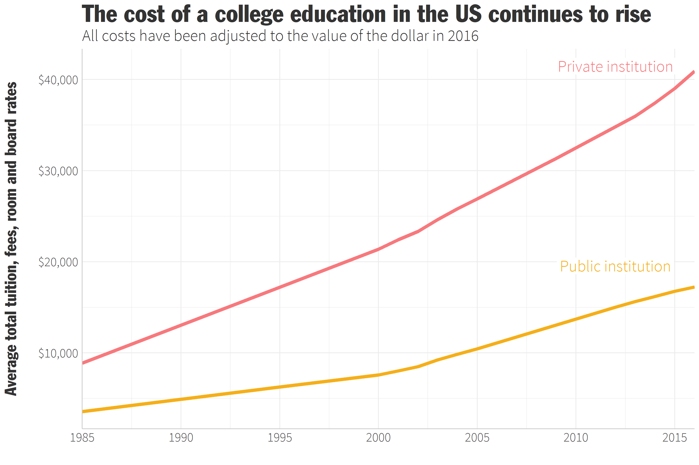
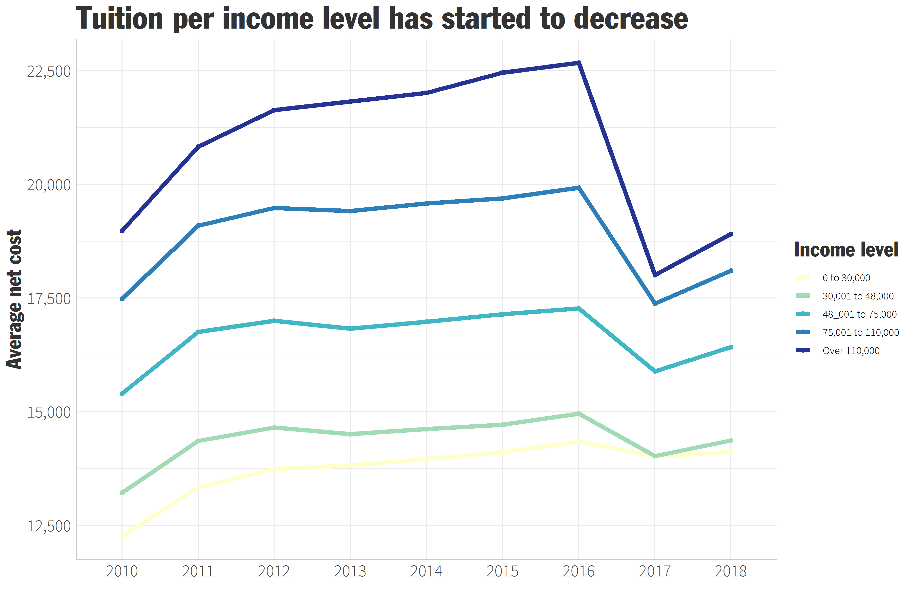
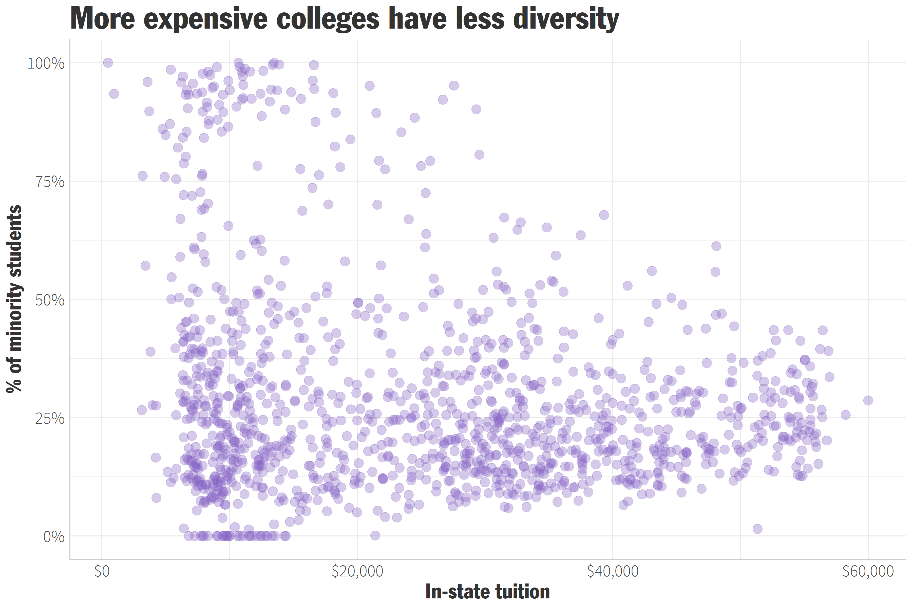

# College tuition, diversity, and pay
The data this week comes from many different sources but originally came from the US Department of Education. 

The details of the datasets can be found [here](https://github.com/rfordatascience/tidytuesday/tree/master/data/2020/2020-03-10).

### Looking at how the price of tuition has changed through time
*Before 2000, the only records available are for 1985 & 1995. There are also gaps in the data for private institutions from 2006-2008/2010-2012 & 2006-2011 for public institutions.*   
 

### How has it changed among income levels?
The data seems to be inconsistent for 2017-2018, so it may be unreliable. The total cost was the same across all income levels for 2017, unlike the other years. An error in the documentation may be the cause of the dip in those two years.  
 

### Let's look at diversity and the in-state cost of tuition
In this case, diversity/minorities = all students who are not categorized as white, race unknown, or a nonresident.   
 

