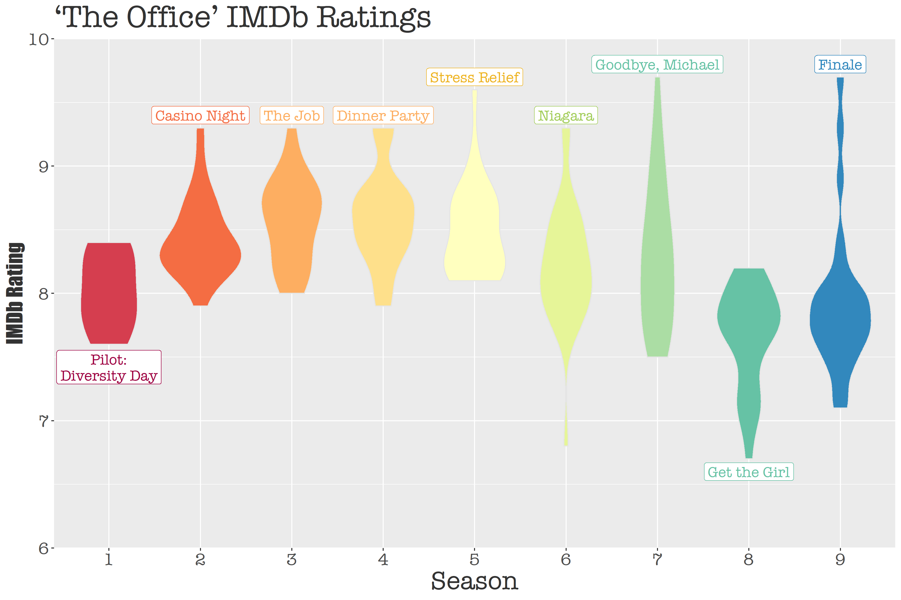

# The Office
The data this week comes from the [`schrute` R package](https://bradlindblad.github.io/schrute/index.html) for *The Office* transcripts and [data.world](https://data.world/anujjain7/the-office-imdb-ratings-dataset) for IMDb ratings of each episode. The featured article is [The Pudding's](https://pudding.cool/) [‘The Office’ Dialogue in Five Charts](https://pudding.cool/2017/08/the-office/), which is 'a breakdown of how every character contributed to the show'.   
<br />


## Ratings
*There are 188 The Office episodes.*   

The first visualization I made was of the episode ratings of the entire series, grouped by season. The width of the violin plot indicates the density of the episodes with that particular rating.   
<br />

Labeled above are the highest rated episodes per season, except in the cases of season 1 and 8, which have their lowest rated episodes labeled. Unsurprisingly, those two seasons were the lowest rated overall of the whole series. "Goodbye, Michael" and "Finale" are tied with the highest IMDb ratings of 9.7, with another fan favorite "Stress Relief" coming in second with a rating of 9.6.   
<br />


## Writers
I also wanted to look into who wrote the episodes and see if there were any particular writers who did the most episodes.   
<br />

Mindy Kaling wrote 20 episodes (including "Goodbye, Michael" `` `r emo::ji("heart")` ``), while BJ Novak wrote the second most at 15. Gene Stupnitsky	and Lee Eisenberg are next with 14. There were 10 episodes without writer data.   
<br />

*NOTE: codes are inefficient and still a WIP.*

<br />
---

Other questions I wanted answered but didn't/couldn't make visualizations about:

* Highest rated episodes - who wrote them? Who was in them? 
  + Mindy Kaling, Greg Daniels, and BJ Novak each wrote three of episodes with the highest IMDb ratings (>= 9). If the episode "Niagara" about Pam & Jim's wedding is to be considered as two episodes, Mindy and Greg (who wrote both) would each have writted four.
* What is the average rating of each writer's episodes?
  + Can be found in the table below:
  
```{r data, message=TRUE, warning=TRUE, include=FALSE}
library(schrute)
library(tidyverse)
library(splitstackshape) ## for cSplit()
library(treemapify) ## for geom_treemap()
library(extrafont)

loadfonts(device = "win", quiet = TRUE) ## to load the font

# Import the transcripts
office_transcript <- schrute::theoffice  ## 55130 lines
office_transcript <- office_transcript %>%
  mutate(season = as.numeric(season),
         episode = as.numeric(if_else(episode_name == "Finale", "23", episode)), ## match finale episode number to the one in office_ratings
         )

# Import the IMDb ratings from data.world
office_ratings <- readr::read_csv('https://raw.githubusercontent.com/rfordatascience/tidytuesday/master/data/2020/2020-03-17/office_ratings.csv')
## 188 episodes

# Join tables to get episode summary
office_episodes <- office_ratings %>%
  left_join(office_transcript, 
            by = c("season" = "season", "episode" = "episode"),
            suffix = c("", "2")) %>% 
  select(-c(character, text, text_w_direction, index)) %>% 
  unique()

writers <- office_episodes %>%
  select(season, episode, episode_name, writer, imdb_rating) %>% 
  cSplit("writer", sep = ";") 

w_1 <- writers %>% 
  filter(!is.na(writer_1)) %>% ## take out obs where the writer is NA
  select(season, episode, writer_1, imdb_rating) %>% 
  rename(writer = writer_1)

w_2 <- writers %>% 
  filter(!is.na(writer_2)) %>% 
  select(season, episode, writer_2, imdb_rating) %>% 
  rename(writer = writer_2)

w_3 <- writers %>% 
  filter(!is.na(writer_3)) %>% 
  select(season, episode, writer_3, imdb_rating) %>% 
  rename(writer = writer_3)

writer_ratings_all <- rbind(w_1, w_2, w_3)
df <- writer_ratings_all %>%  ## summary of each writer's average rating and # of episodes they wrote
  group_by(writer) %>% 
  summarise(avg_value = mean(imdb_rating), count = n()) %>% 
  arrange(desc(count)) %>% 
  rename(avg_rating = avg_value,
         episode_count = count)
```
```{r echo=FALSE, message=TRUE, warning=TRUE, paged.print=TRUE}
knitr::kable(df)
```
   
<br />

*Credit: [Isabella Benabaye](https://www.linkedin.com/in/isabella-benabaye/)*