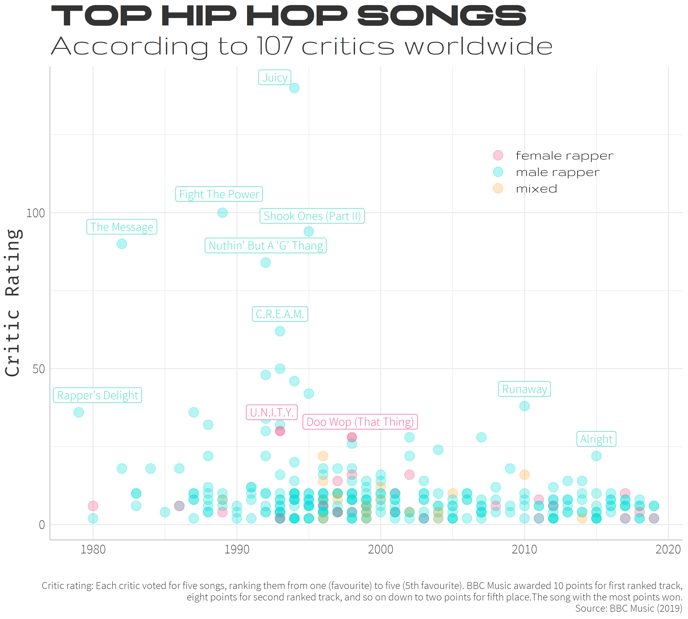
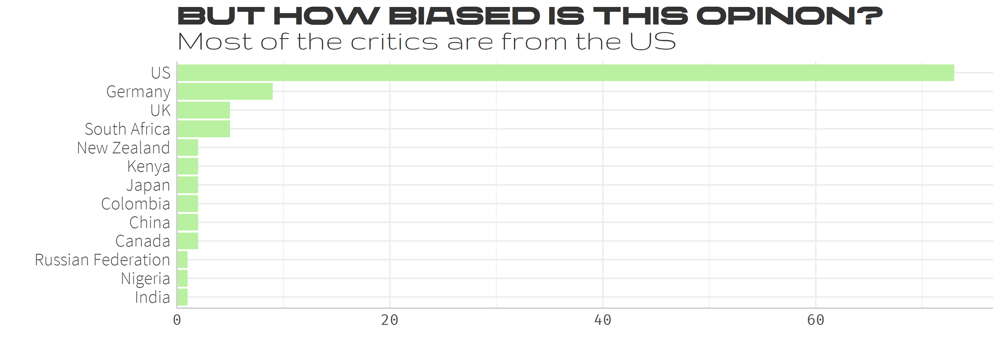
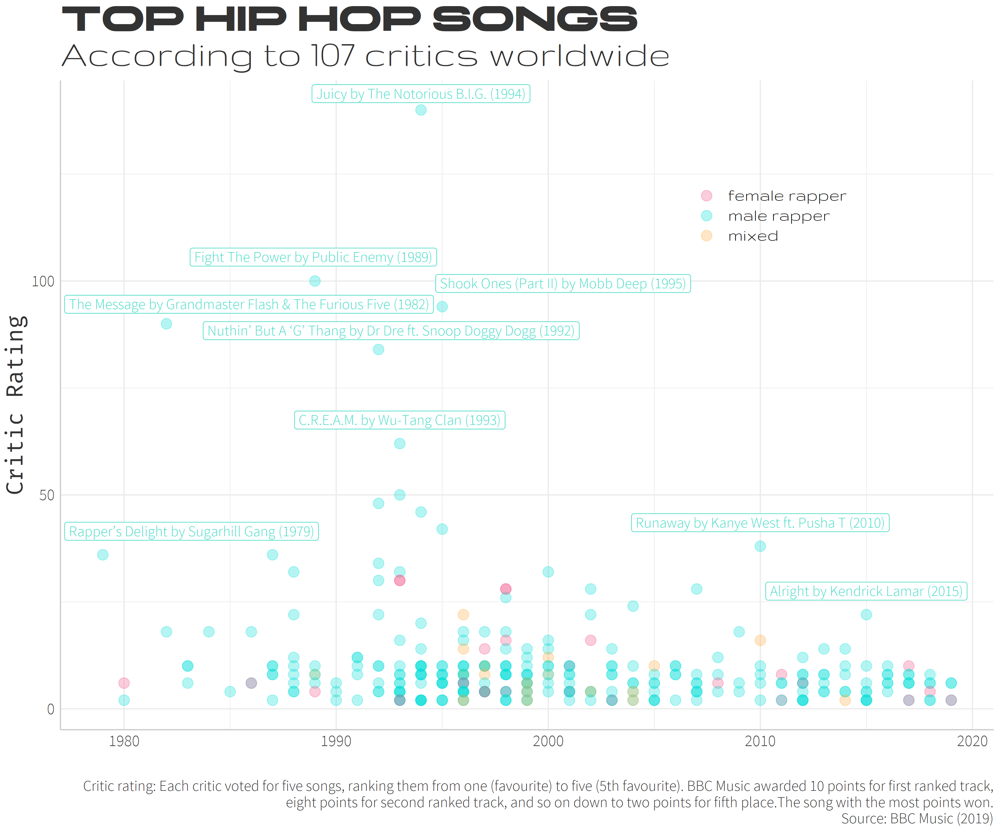

# Best Rap Songs
Since hip hop is one of my favorite genres, I was really excited to create the visualizations for this week. There is a total of 311 songs that made it to the top 5 list of 107 'critics' chosen by BBC Music.   
 

It's notable the Jay-Z has the most songs in the list with 15, Kendrick Lamar coming in second with 10.   

The respondents of this survey is a collection of 107 people who BBC classifies as hip-hop and music experts – critics, industry figures, artists, and academics. The outcome of their survey sure was interesting, but of course the song rankings depend heavily on the critic's preferences. Let's look a little into that.   
 

The critics come from 13 countries overall, but unsurprisingly are predominantly from the United States.

### On female artists
Of the 311 songs, only 23 had a female artist. Missy Elliot, Lauryn Hill, and Salt-N-Pepa are the only artist with more than one song in the list, Missy with 4 and Lauryn Hill and Salt-N-Pepa with 2 each. The top songs however were "U.N.I.T.Y." by Queen Latifah (1993) (30 pts) and Doo Wop (That Thing) by Lauryn Hill (1998) (28 pts). The rest of the songs were more than 10 points behind Doo Wop.

### Another version of the top songs chart
Originally, I wanted to include the artist and song year info in the first chart, but the text would have to be small since some artist's names were so long. I still made it though, and it is best viewed full screen, but it would probably be best to have an interactive plot to better view this data. 

